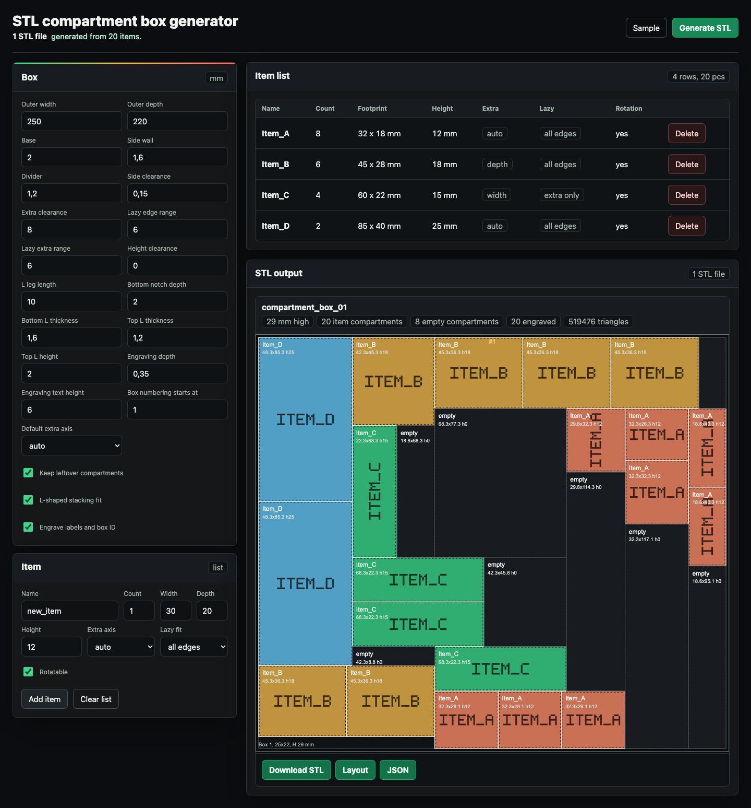
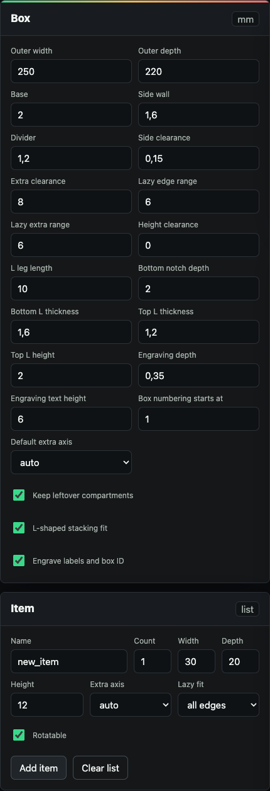
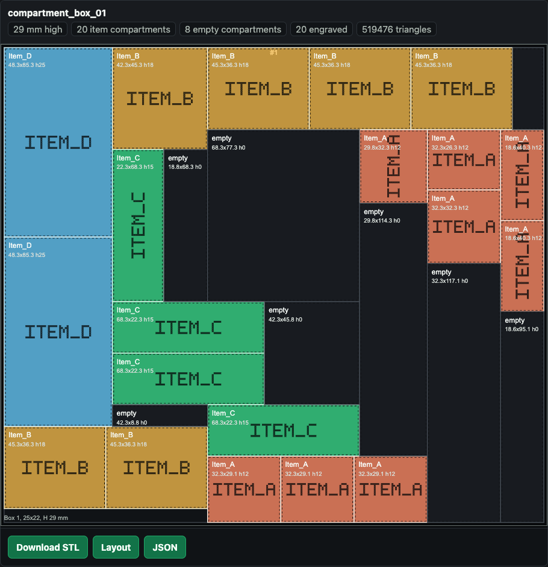

# STL compartment box generator

Design custom organizer boxes from the items you already have. Add dimensions, generate STL files, and print fitted compartments in minutes. No CAD workflow, no install step.

## Use It

Open [STL-compartment-box-generator.html](./STL-compartment-box-generator.html), tune the box, and add the things you want to store.

Click **Generate STL** and check the generated layout before printing.

## Why It Works

- Item-first: enter counts and dimensions instead of drawing dividers by hand.
- Fast output: one printable STL per generated box.
- Built-in checks: layout SVG and JSON placement summary.
- Practical options: rotation, clearances, engraved compartment labels, configurable box IDs, separate lazy edge ranges, leftover compartments, and L-shaped stacking fit.
- Local: everything runs in the browser from a single HTML file.

## Exports

- `compartment_box_01.stl`
- `compartment_box_01_layout.svg`
- `compartment_box_summary.json`
